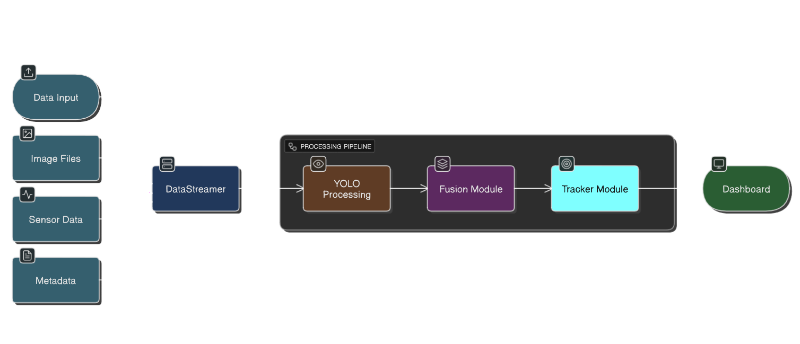
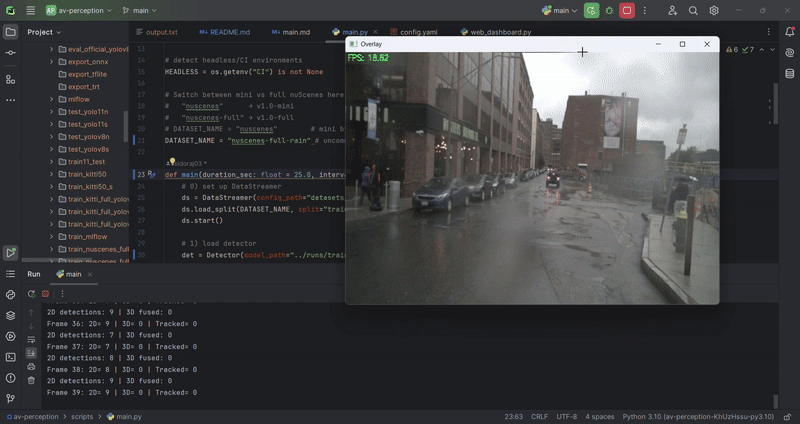
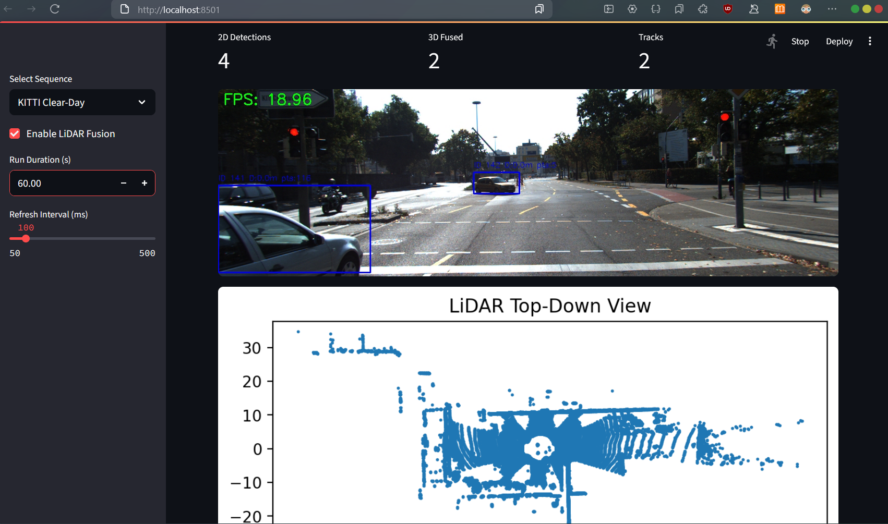

# AV‑Perception 



*A lightweight, script‑first perception stack for autonomous‑vehicle research.  
YOLO‑based 2D detection ➜ LiDAR fusion ➜ simple 3D tracking ➜ Streamlit dashboard.*

---

## Features

| Area | What you get |
|------|--------------|
| **Datasets** | On‑the‑fly streaming of **KITTI** and **nuScenes** (mini & full) via `DataStreamer` |
| **Detection** | Plug‑and‑play Ultralytics **YOLOv8 / YOLOv11** with one‑line swap |
| **Sensor Fusion** | Late‑fusion engine that re‑scores detections with LiDAR evidence |
| **Tracking** | Minimal SORT/ByteTrack‑compatible wrapper for 3‑D boxes |
| **Benchmarking** | Reproducible `eval.py` + `benchmark_official.py` scripts with mAP/FPS summary |
| **Export** | One‑command ONNX export & checker |
| **Visualisation** | Real‑time Streamlit dashboard + OpenCV overlay |
| **Testing** | ~20 PyTest cases for CI peace‑of‑mind |
---

## Quick start

```bash
# Clone & install (Poetry)
git clone https://github.com/<you>/av-perception.git
cd av-perception
poetry install
poetry shell  # activate venv
```

### 1. Download datasets

| Dataset | Official link | What to download | Where to place |
|---------|---------------|------------------|----------------|
| **KITTI Object** | <https://www.cvlibs.net/datasets/kitti/> | *data_object_image_2*, *data_object_velodyne*, *data_object_label_2* (+ *data_object_calib*) | `datasets/` (so paths look like `datasets/data_object_image_2/...`) |
| **nuScenes** | <https://www.nuscenes.org/download> | *v1.0-mini* **or** full *v1.0-trainval* ± *v1.0-test* | `datasets/` (keep the folder names created by the NuScenes script) |

> **Tip** – the repo’s `datasets/config.yaml` expects the above layout **out‑of‑the‑box**.  
> If you put the data elsewhere, just tweak the `root:` entries.

### 2. (Optional) create small subsets

```bash
# 50‑image KITTI toy‑set (for CPU tests)
python scripts/create_kitti_subset.py -n 50

# Full KITTI in YOLO format (~7k imgs)
python scripts/create_kitti_full.py

# 1 500‑frame front‑camera slice from nuScenes‑full
python scripts/create_nuscenes_subset.py -n 1500
```

These scripts populate `datasets/kitti50/`, `datasets/kitti_full/` and `datasets/nuscenes_subset/` and drop ready‑to‑use YAMLs alongside them.

### 3. Train / evaluate

```bash
# a) Train (CPU example)
python scripts/train.py \
  --model yolov8n \
  --data datasets/kitti50.yaml \
  --epochs 1 --batch-size 4

# b) Benchmark official YOLOs (mAP + FPS)
python scripts/benchmark_official.py --data datasets/kitti50.yaml

# c) Export to ONNX
python scripts/export.py -w yolov8n.pt -f onnx --output-dir exports
```

### 4. Real‑time demo

```bash
# OpenCV window (10 s playback)
python scripts/main.py
```


```bash
# Or launch the Streamlit dashboard
streamlit run scripts/web_dashboard.py
```



---

## Repository layout

```
├── datasets/
│   ├── config.yaml          # registry of all dataset roots
│   ├── v1.0-mini/           # nuScenes mini (after download)
│   ├── v1.0-full/           # nuScenes full
│   ├── data_object_image_2/ # KITTI RGBs
│   ├── data_object_velodyne/# KITTI point‑clouds
│   ├── kitti50/             # ← generated subset
│   └── …
├── docs/
│   └── assets/
│       ├── pipeline_overview.png   # ← add architecture diagram
│       ├── sample_detection.gif    # ← YOLO + fusion overlay clip
│       └── dashboard_screenshot.png
└── scripts/
    ├── train.py
    ├── eval.py
    └── …
```

Add your own screenshots or renders to **`docs/assets/`** and they will be displayed automatically by the Markdown:

* `pipeline_overview.png` – high‑level block diagram (top of README).  
* `sample_detection.gif` – 5–10 s GIF of the OpenCV overlay (under *Demo*).  
* `dashboard_screenshot.png` – Streamlit UI (under *Dashboard*).

---

## Dataset anatomy (TL;DR)

```
datasets/
├── data_object_image_2/            # KITTI RGBs
│   └── training/image_2/000000.png
├── data_object_velodyne/
│   └── training/velodyne/000000.bin
├── v1.0-mini/                      # nuScenes mini as‑is
│   ├── samples/CAM_FRONT/…
│   └── sweeps/LIDAR_TOP/…
└── v1.0-full/                      # full nuScenes trainval/test
    └── …
```

No extra renaming needed – just unzip into `datasets/`.

---

## Testing

```bash
pytest -q
```

All CI tests run in pure‑CPU mode and rely only on the 50‑image subset.


---


> Built by *Isidora Jakovlevska*
